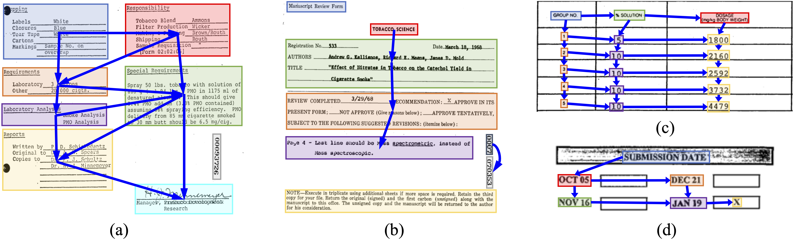

# Modeling Layout Reading Order as Ordering Relations for Visually-rich Document Understanding

This is the official repository of these VrDU datasets:
1. EC-FUNSD, a benchmark of semantic entity recognition (SER) and entity linking (EL), focusing on entity-centric robustness evaluation of pre-trained text-and-layout models [[paper]](https://arxiv.org/abs/2402.02379);

<div align=center>

</div>

2. ROOR, a reading order prediction (ROP) benchmark which annotates layout reading order as ordering relations [[paper]](https://arxiv.org/abs/2402.02379).

<div align=center>

</div>
Please refer to [ROOR](https://github.com/chongzhangFDU/ROOR) for the relevant code implementation.

## Datasets

The structure of the released datasets is listed below, in which:

* `data.*.txt` denotes the train/val/test split of the dataset. The format of each row is `0000971160.json` to specify a document sample.
* `labels.txt` denote the entity types of the SER task from EC-FUNSD.
* `images` contain the document images of the samples.
* `jsons` contain the annotations of the samples. The datasets EC-FUNSD and ROOR share the same layout annotations. Therefore, for each document sample, the layout annotation and the SER and EL annotation from EC-FUNSD and the ROP annotation from ROOR are integrated into one single JSON file. Within the file, the annotations of layout and these three tasks are indicated by distinct keys.

```
data
├── images
│   ├── 0000971160.png
│   ├── 0000989556.png
│   ├── ...
│   └── 93455715.png
├── jsons
│   ├── 0000971160.json
│   ├── 0000989556.json
│   ├── ...
│   └── 93455715.json
├── data.train.txt
├── data.val.txt
└── labels.txt
```

One sample annotation is displayed below, in which:

* `"uid"` identifies the data sample.
* `"img"` refers to the corresponding document image, toghther with its height and width information.
* `"document"` refers to the corresponding layout annotations. Each element refers to one segment.
  * `"id"` identifies the segment. `"box"` refers to the position box of the segment. `"text"` refers to the text the segment contains.
  * `"words"` refers to the words within the segment, where
    * `"id"` identifies the word, globally within the sample, and is used in `"label_entities"`. `"box"` refers to the position box of the word. `"text"` refers to the text of the word.
* `"label_entities"` refers to the corresponding SER annotations. Each element refers to one entity.
  * `"entity_id"` identifies the entity. `label` refers to the entity type.
  * `"word_idx"` refers to the word sequence that composes the entity, denoted by a list of word indexes. The indexes are guaranteed to be consecutive. 
* `"label_linkings"` refers to the corresponding EL annotations. Each element is a linking pair indicating to the `entity_id` of the head and tail entities.
* `"ro_linkings"` refers to the corresponding RO relation annotations. Each element is a linking pair indicating to the `entity_id` of the head and tail entities.

```json
{
    "uid": "00040534", 
    "img": {"fname": "images/00040534.png", "height": 1000, "width": 777}, 
    "document": [
        {
            "id": 0, "box": [80, 946, 202, 956], "text": "LORILLARO RESEARCH CENTER", 
            "words": [
                {"box": [80, 946, 123, 956], "id": 0, "text": "LORILLARO"}, 
                {"box": [124, 946, 165, 956], "id": 1, "text": "RESEARCH"}, 
                {"box": [168, 946, 202, 956], "id": 2, "text": "CENTER"}]},
        ...
    ], 
    "label_entities": [
        {"entity_id": 0, "label": "question", "word_idx": [16]}, 
        ...
    ], 
    "label_linkings": [[0, 35], [1, 36], ...], 
    "ro_linkings": [[1, 29], [2, 34], ...]
}
```

[EC-FUNSD](https://paperswithcode.com/dataset/ec-funsd) and [ROOR](https://paperswithcode.com/dataset/roor) are currently available at Papers With Code. 

## Citation

If you found this repository useful, please cite our paper:

```
@article{zhang2024modeling,
  title={Modeling Layout Reading Order as Ordering Relations for Visually-rich Document Understanding},
  author={Zhang, Chong and Tu, Yi and Zhao, Yixi and Yuan, Chenshu and Chen, Huan and Zhang, Yue and Chai, Mingxu and Guo, Ya and Zhu, Huijia and Zhang, Qi and others},
  journal={arXiv preprint arXiv:2409.19672},
  year={2024}
}

@article{zhang2024rethinking,
  title={Rethinking the Evaluation of Pre-trained Text-and-Layout Models from an Entity-Centric Perspective},
  author={Zhang, Chong and Zhao, Yixi and Yuan, Chenshu and Tu, Yi and Guo, Ya and Zhang, Qi},
  journal={arXiv preprint arXiv:2402.02379},
  year={2024}
}
```

## License

All datasets in this repository are released under the CC BY 4.0 International license, which can be found [here](https://creativecommons.org/licenses/by/4.0/legalcode).
These datasets utilize the [FUNSD](https://guillaumejaume.github.io/FUNSD/work/) dataset, along with their respective licensing agreements.